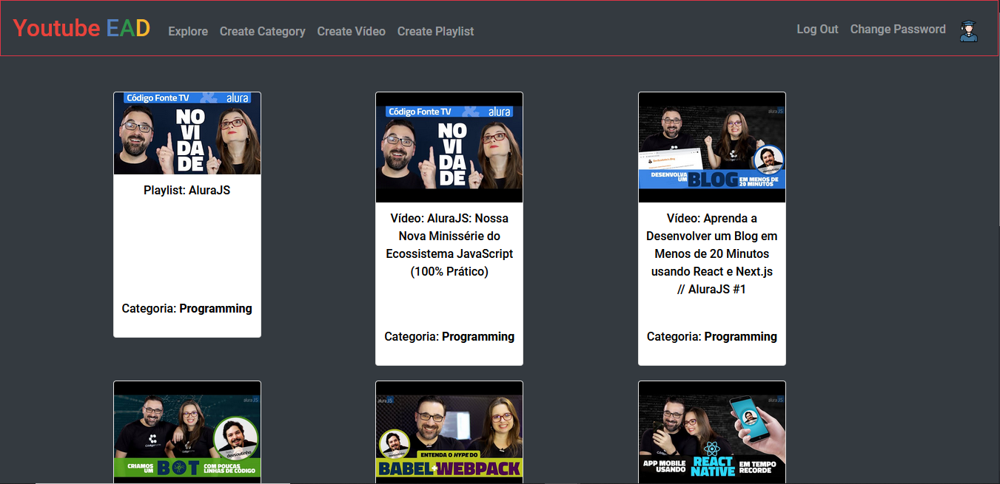

<h1 align="center">
    <a href="https://www.youtube.com/">🔗 Youtube</a> EAD (FLASK-CS50_Final_Project)</a>
</h1>
<h2 align="center">🚀 Study via Youtube 🚀</h2>



Content
=================
   * [About](#About)
   * [Technologies](#Technologies)
   * [Downloading](#Downloading)
   * [StartingTheApplication](#Starting)
  
<h3 align="center"> 
	🚧 In Build...  🚧
</h3>

### Features

- [x] Register user
- [x] Register video
- [x] Register playlist
- [x] View user
- [x] View video
- [x] View playlist
- [ ] Like a video
- [ ] Dislike a video
- [x] Update password
- [x] Update name
- [x] Update Level of user
- [x] Update playlist
- [x] All actions of user in index page
 

<div id="About">    

## About
### This is @ davidlpc1's final project for Harvard's cs50 course.
### The project proposes that you study through educational YouTube videos and help other students present on our platform, adding videos and playlists

</div>

<div id="Downloading">

## Downloading

<strong><a href="https://github.com/davidlpc1/Final_Project_CS50/archive/main.zip">Download ZIP</a></strong>
<strong>OR</strong>

```
git clone https://github.com/davidlpc1/Final_Project_CS50
```

</div>

<div id="Technologies">

## Technologies

<code></code>
<code></code>
<code></code>
<code></code>
<code></code>
<code></code>
</div>

<div id="Starting">

## POWERSHELL 
```
pip install cs50
pip install Flask
pip install Flask-Session
pip install requests

$env:FLASK_APP = "application.py"  
$env:FLASK_ENV = "development" 
$env:FLASK_DEBUG=0

flask run
```
## CMD 
```
pip install cs50
pip install Flask
pip install Flask-Session
pip install requests

set FLASK_APP=application.py 
set FLASK_ENV=development 
set FLASK_DEBUG=0

flask run
```
## Linux,Mac
``` 
pip install cs50
pip install Flask
pip install Flask-Session
pip install requests

export FLASK_APP=application.py 
export FLASK_ENV=development 
export FLASK_DEBUG=0

flask run
```
</div>

### Autor
---

<a href="https://github.com/davidlpc1">
 
 <br />
 <sub><b>Davi Lucas</b></sub></a> <a href="https://app.rocketseat.com.br/me/davi-lucas-marques-de-freitas-04149">🚀</a>


Made with ❤️ by Davi Lucas 👋🏽 Contact me!

[](https://twitter.com/ProgramadorDavi) [](https://www.linkedin.com/in/davi-lucas-93abb71b3/) 
[](mailto:davilucasdlcreator@gmail.com)